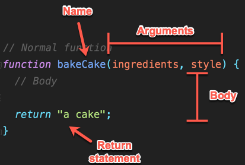
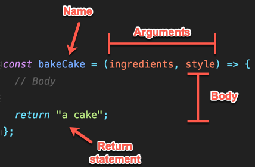
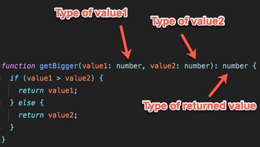
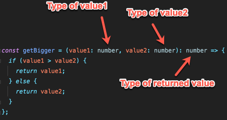

# Functions

<details>
  <summary>TL;DR</summary>

A function is a type of value that contains a set of instructions that can be executed at will. Just as any other type
of value, functions can be stored in variables and passed around.

</details>

<hr>

Functions can be seen as a way to store a set of instructions.

Imagine writing down a recipe on how to cook a pie. The recipe itself is a thing, you can sell it, you can publish it,
you can send it to your mom, or a friend can ask you for it. But more importantly, you or someone else can follow it to
create something (in this case a pie).

Functions behave in a similar way. You can create a function, you can store it, you can pass it down to other parts of
your code, or you can execute it.

> Executing the instructions contained in a function is called "calling the function"

## Syntax

Functions can be written in two different ways, as **normal functions**, or as **arrow functions** (also called
**lambda functions**). While we explore how to write and use functions we'll show both ways so that you can compare them.

It is important to know how to write both styles so that you can identify when a function is being declared/used.

We'll cover their differences as well as when to use which one in a future lesson.

### How to declare a function

```typescript
// Normal function
function bakeCake(ingredients, style) {
  // Body

  return "a cake";
}
```

```typescript
// Arrow function
const bakeCake = (ingredients, style) => {
  // Body

  return "a cake";
};
```

A function is composed of the following parts:

- **Name** _(Optional)_. It is very similar to a variable name. It gives us a way to refer to the function to do something with it
- **Arguments** _(Optional)_. A comma separated list of variables that will hold values provided to the function. They
  can be seen as **a function's input**.
- **Body**. JavaScript code that the function holds. Whenever the function is _called_ this is the code that will be
  executed. For example, if we are baking a cake, the body could be something like:
  - Mix ingredients
  - Preheat oven
  - Put ingredients in the oven
  - Etc.
- **Return statement** _(Optional)_. The `return` statement indicates the function to finish executing and optionally,
  provide an output to whoever called the function. If no `return` statement is added to the body, the function will
  simply execute all lines of code and automatically "return" whenever it reaches the end (giving back `undefined`).

Try to identify these parts in the code above.

<hr>
<details>
<summary>Answer</summary>

Normal function:



Arrow function:



</details>
<hr>

### How to call a function

As previously mentioned, functions are a type of value that contain a set of instructions. These instructions can be
executed by "calling" the function (remember, we call executing a function "calling it").

A function is called by using parentheses after the function name and optionally providing values for the function's
arguments.

```typescript
const sayHi = (): void => {
  console.log("Hi!");
};

// Calling a function without arguments
sayHi();

const sayHiMultipleTimes = (times: number): void => {
  for (let i = 0; i < times; i++) {
    sayHi();
  }
};

// Calling a function with one argument
sayHiMultipleTimes(5);
```

Try to guess what the previous code would do.

<hr>
<details>
<summary>Answer</summary>

It would log the following text:

```text
Hi!
Hi!
Hi!
Hi!
Hi!
Hi!
```

The first "Hi!" message would be logged because of call in line 6 `sayHi();`. The next 5 messages would be logged because
of the `sayHiMultipleTimes(5);` call in the last line.

</details>
<hr>

## Practice 1

> Stop reading this file and answer the following tasks. Once done, come back to the document and continue reading.

- [Simple function](../tasks/001-simple-function/1.instructions.md)
- [Arrow functions](../tasks/002-arrow-functions/1.instructions.md)

## Specifying a function's types

> 🚨 **TypeScript**

As you could have noticed while answering the [Arrow functions](../tasks/002-arrow-functions/1.instructions.md) task,
realizing which type of values a function can receive as arguments and which ones it can return is quite important.

If the function is called with the wrong type the application could behave in unexpected ways or error out.

Fortunately, if you are using [TypeScript] you can declare accepted types for parameters and also the type of value
a function will return.

Try to identify where types are defined for each type of function:

<hr>
<details>
<summary>Normal function</summary>

```typescript
function getBigger(value1: number, value2: number): number {
  if (value1 > value2) {
    return value1;
  } else {
    return value2;
  }
}
```

  <details>
  <summary>💡 Answer</summary>



  </details>

</details>
<hr>

<hr>
<details>
<summary>Arrow function</summary>

```typescript
const getBigger = (value1: number, value2: number): number => {
  if (value1 > value2) {
    return value1;
  } else {
    return value2;
  }
};
```

  <details>
  <summary>💡 Answer</summary>



  </details>

</details>
<hr>

If a function isn't supposed to return a value the special TypeScript type `void` can be used. Using either `undefined`
or `void` indicate that the function's returned value will be `undefined`, the difference is that when `void` is used,
it also signals that whoever is calling the function shouldn't expect a value back at all.

```typescript
// Using void
function logMyName(): void {
  console.log("My name");
}

// This isn't valid
const result = logMyName();
```

```typescript
// Using undefined
function logMyAge(): undefined {
  console.log("My age");
}

// This is valid, result will be 'undefined'
const result = logMyAge();
```

> Unless you have a valid reason, **ALWAYS use `void` to indicate that a function doesn't return a value**

<hr>

## Practice 2

- [Function types](../tasks/003-function-types/1.instructions.md)
